# The Micro Universe

A mobile minigame focusing on PCG, and fun.

malosgao · Gavin KG · gavin_kg@outlook.com

---

[TOC]

## 游戏简述

### 游戏剧情

在我们日常使用的手机屏幕的背后，其实是一个持续不断为用户提供服务的微观世界。

这个游戏首先会提供给玩家一个涂色程序，当玩家画好并且点击上色时，由于微观世界的小故障，玩家在不经意间被卷入到了背后的世界中。世界的结构和玩家绘制的万花筒图案组成一致，但由于并没有成功上色的缘故，场景依然是一片黑暗并失去了色彩。在这个微观世界中，居住着的是一些被称为“待定”（可以理解为集成电路中的电子）的成员，他们穿梭于不同区域之间，像电路一般，移动、吸引并点亮区域中的“能量柱”，维持着世界持续运转。

玩家成为了一名“待定”，来到了这个暂时故障的都市。玩家需要操作着自己控制的“待定”在这个世界中，重新开启区域中所有的“能量柱”，继而解锁并点亮一片又一片的区域。当所有区域都被点亮时，整个城市重新恢复了原来的色彩，而巧合的是，整个城市的色彩正好是涂色程序所渲染出的色彩。玩家控制的“待定”完成了目标，欣赏着由于自己的努力而恢复了功能和色彩的城市，回到了原本的身体中。屏幕上显示的，则是一个完整涂好色的图案。

### 游戏内核

整个游戏其实是一个打破第四面墙的 Meta 游戏，并且具有双关性。玩家执行手机程序，屏幕后的都市（类似于电路）负责运行程序的逻辑；玩家程序出现故障，“待定”通过自己的努力恢复都市的正常运转；玩家执行涂色，屏幕后的都市从一开始的黑暗到玩家解锁全部区域后的生机勃勃，并且整个都市的样式**直接为涂色的结果**。玩家同时具有两种身份，第一身份是涂色软件的使用者，第二身份是都市“待定”的操作者，服务于涂色软件的使用者（即第一身份）。

游戏使用 top-down 视角，通过摇杆或屏幕上虚拟摇杆来操控“待定”的运动。

## 游戏流程

### 开场界面

上来肯定是 Made with Unity，然后接上魔方工作室的标志和“由malosgao为您献上”，然后切黑。

### 万花筒绘制

// 20200705：milo 说要基于一个随机数种子，所以打算看看能不能用一个随机数滑条来代替用手绘制生成万花筒图案。如果能够允许除了随机数种子以外的更复杂的操作，可以同时保留画图和生成万花筒的方案。

从黑切入一个手机UI界面，用来给用户进行万花筒图案的绘制，可以参考《万花筒涂鸦》。界面亮色，左侧可以选择万花筒扇形数目（可选），右边可以选择颜色 Pattern（可选），下方一开始是一个进度条，当用户画到一定程度时进度条走满，显示出“上色！”按钮。

绘制界面需要限制一下玩家能够绘制的区域，整体画板区域是一个空心圆环，留出内环区域用来做中心节点（当前设想是内环不一定是城墙，可以和外部区域共享，看实现难度可能会改变这个设定），外环区域用来做外城墙；用户可绘制的区域是这个空心圆的一个小扇形。小扇形必须从下到上**完全绘制**进度条才会走满。

这里的UI风格设计可以不用完全按照手机UI，可以夸张一些，画风可以和《Flat Heros》类似，走 Pop 风格。

为了给用户绘制的时候其实是在控制后面 Micro Universe 城市的建成，界面选择为亮色来模拟背后城市的太阳光，并且当前画在Canvas上的图案可以做一次毛玻璃模糊后贴在后面，但是一定要糊，一是因为不会露馅，二是因为一开始绘制的时候不想给玩家meta的感觉。

### Loading 前

当用户点击“上色！”按钮后，模拟系统短时间失去响应，继而闪一下 Glitch 特效，界面背景切几次灰，模拟给后面世界的太阳供电的灯憋了的感觉，继而永久切灰。镜头前推，营造一种推入手机屏幕的感觉。玩家画的万花筒图案变成一个个粒子，带着扰动同样深入到屏幕中（此效果选作）。镜头这时已经完全推入“云层”，成为一个纯灰色的背景，此时可以开始Loading并且不会产生卡顿感觉了。

### Loading

Loading 期间屏幕不产生任何变动，摄像机直接 Culling = 0，按照下面列表开始生成资源：

* 对手绘的万花筒图二值化。下方根据需求 Blit 到相应的分辨率上，不再赘述；
* 使用 Marching Square 生成城墙顶和四周的墙壁，并且结合轮廓生成塔楼和UV（UV1存放局部贴图UV，UV2存世界级别的UV）；
* 对墙顶生成 Mask，用 Flood Fill 拆出内部区域，算出中心点，保留所有区域的 Texture 用来做灯光 Mask；
* 用最小生成树算出一条连通路径，同时算出路径和墙壁的交汇点，用挖空材质挖出通道（不真正动模型）;
* 每个内部区域变换到条带空间（极坐标空间）；
* 对于每个变换后的内部区域，从交汇点开始用【算法待定】挖出路网；
* 路网生成水平 Mesh （用于上纹理）和垂直 Mesh（用于变换回去以后给碰撞器）；
* 对于剩余的内部区域，用 WFC 算出“电容器建筑”布局；
* 将建筑和路网 Mesh 变换回笛卡尔坐标系（顶点数量大的话可以用 Compute Shader）；
* 将墙壁和建筑生成 Mask，高斯模糊做 AO；
* Top-down 渲染整个场景（或者只用整个场景的 Albedo 做 Replacement Material 渲染），高斯模糊做 GI 采样图；
* 手动配置 Light Probe 阵列，对于每个 Probe 用上面的 GI 采样图配置 SH 参数；
* 将变换后的路网 Mesh 赋予 Mesh Collider；
* Quasirandom 撒 Stub【算法待考量】，然后迭代位置；
* *用之前的Mask图生成SDF，绘制建筑物轮廓【算法待考量】，并且用 Compute Shader 收束粒子到SDF生成附近的装饰物摆放位置。
* 初始化剩余控制器。

### Loading 后

场景配置好以后，视野从“云层”里推出来。之前提到，由于未知原因导致这里停止了运行，因此此处在空中划过几道闪电，照亮场景（冷光源直接闪几下），展现出整个程序化生成的世界。世界几乎黑暗，由主光源产生月光的效果，但地上供小球挂着的 Stub 闪着微微的光（可以是 Emission，也可以用金属材质，用Bloom出光晕）。小球出生点在一个区域的入口处（上述提到的交汇点）。镜头缓缓推向小球。之后根据 FTUE 参数弹出静态教程。

### Gameplay（待完善）

场景除了主摄像机拍摄以外，还有一个辅助正交摄像机拍摄光源的 Mask 到一张灰阶纹理（黑色代表场景的夜晚，白色代表白天）。纹理初始为黑色，每激活一个 Stub，会有一些白色半透明烟雾状粒子在Stub生成，并渲染到辅助摄像机中，产生此处被暂时照亮的效果。同时，摄像机会拍摄到一张永久的Mask图，当解锁一整个区域时，这个永久Mask图会逐渐叠加（噪声叠加）整个区域的Mask图（之前Flood Fill时生成过），产生整个区域被永久照亮的效果。场景中所有物体的Shader用世界坐标/区域长宽采样这张图做Mask来实现这种效果（和AO一样的做法）。

小球按照下面提到的核心玩法在不同区域中使用Stub穿梭，激活Stub继而解锁一整个区域。当一个完整的区域被解锁，除了叠加Mask将该区域从“夜晚”转换成“白天”之后，将根据之前提到的SDF的方法摆放场景的装饰物。摆放过程动态进行，效果是装饰物从地图上到下一个一个pop出来。完整照亮之后，也可以将那片区域的纹理从中心扩散“上”到模型上，即模型的纹理采样强度也通过这张Mask图做，当黑暗时模型完全没有纹理，暂时被照亮/白天的情况纹理全部显示。

当所有区域都解锁后，中心区域（玩家进入不到中心区域）的主Stub被点亮，整个场景完全变亮（Mask图逐渐全白），游玩结束。

### 结束界面

游玩结束后，镜头逐渐拉远并垂直朝向地面（可以同时调小FOV，但是会有种希区柯克式变焦的感觉，不太喜欢），一段时间后上一个风格化后处理，继续上推，再过一段时间，之前开始界面的UI飞回场景中，按钮显示“已上色”。

一段时间过后，场景整体模糊，显示游戏的Logo“The Micro Universe”，背景淡出，流程结束。

有时间可以做一下stuff界面。

## 技术要点

### 图案的绘制

### Ring2Stripe

将bitmap变换子区域到strip空间算路，算完之后把mesh变换回ring空间。

### Marching Square / Cube using Scalar Fields

http://thebigsmall.uk/uncategorized/part-1-contour-maps/

https://www.youtube.com/watch?v=yOgIncKp0BE

用来生成城墙mesh。

Why Marching Square instead of Dual Contouring?

https://www.boristhebrave.com/2018/04/15/dual-contouring-tutorial/

https://wordsandbuttons.online/interactive_explanation_of_marching_cubes_and_dual_contouring.html

### Flood Fill

算中心，隔离出子区域范围。

### Minimum Spanning Tree (*MST*)

算子区域联通路径，同时挖空bitmap。

### Agent based Urban Road Generation

子区域算路，Agent-based solution。

### SDF Contour

SDF Generator: https://catlikecoding.com/sdf-toolkit/docs/texture-generator/

子区域美化，绘制轮廓

### Wave Function Collapse (WFC)

https://www.youtube.com/watch?v=0bcZb-SsnrA

https://zhuanlan.zhihu.com/p/66416593

波函数坍缩用来做连续楼房的布局

### Procedural Texture

DDX/DDY wall tile

程序化闪电。

### "Stub" Generation

用来提供gameplay机制。

### 装饰物摆放

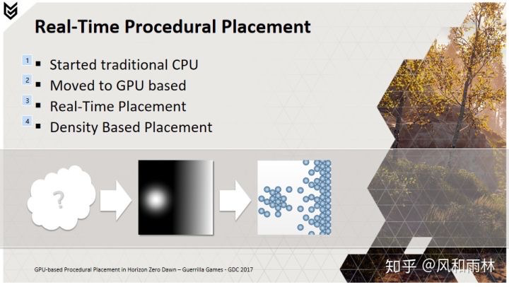

## 艺术风格参考

### 中心城市的总体结构

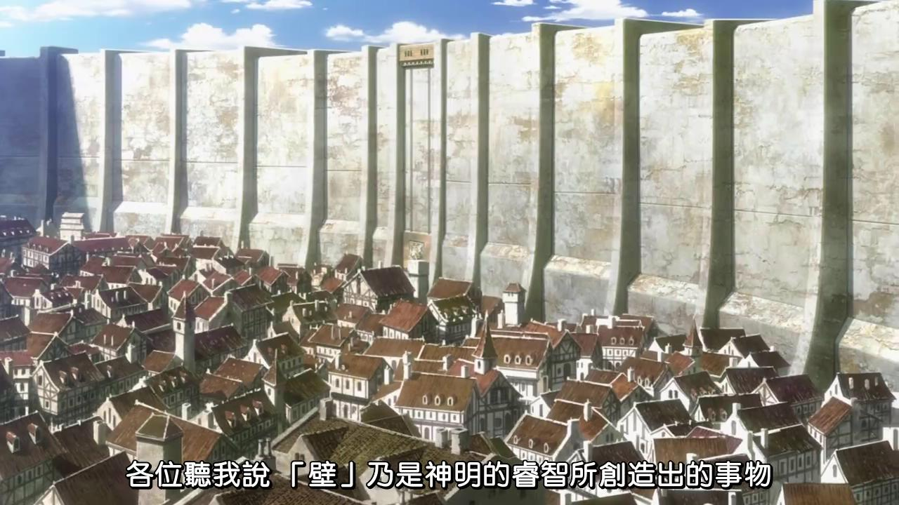

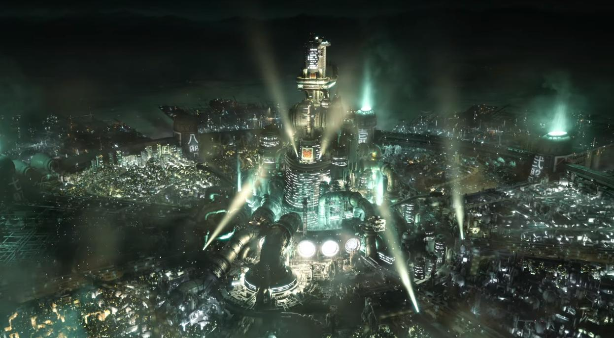

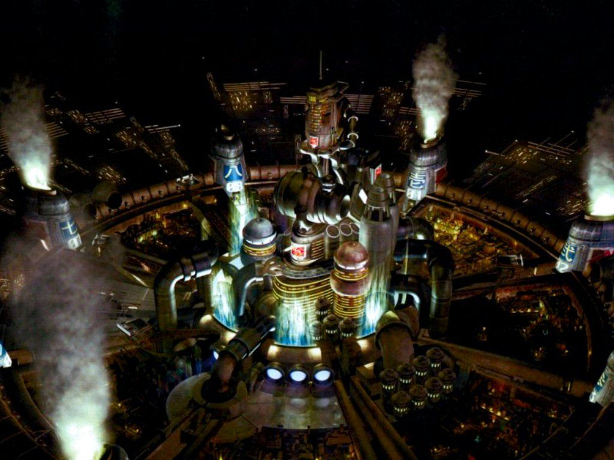

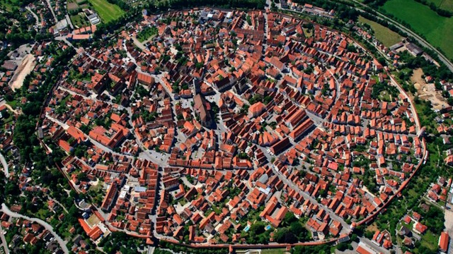

### 城市配色及风格

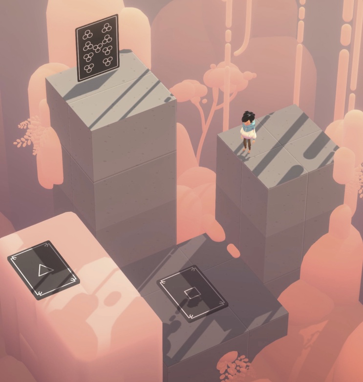

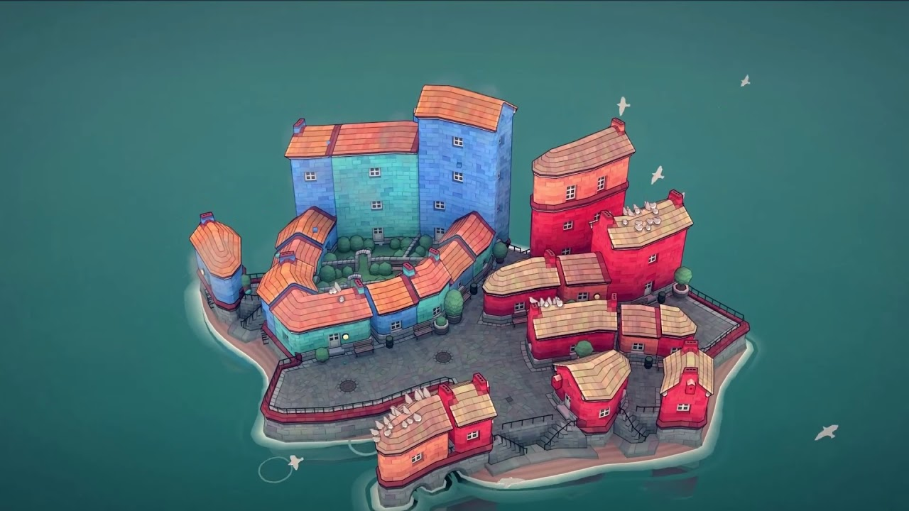

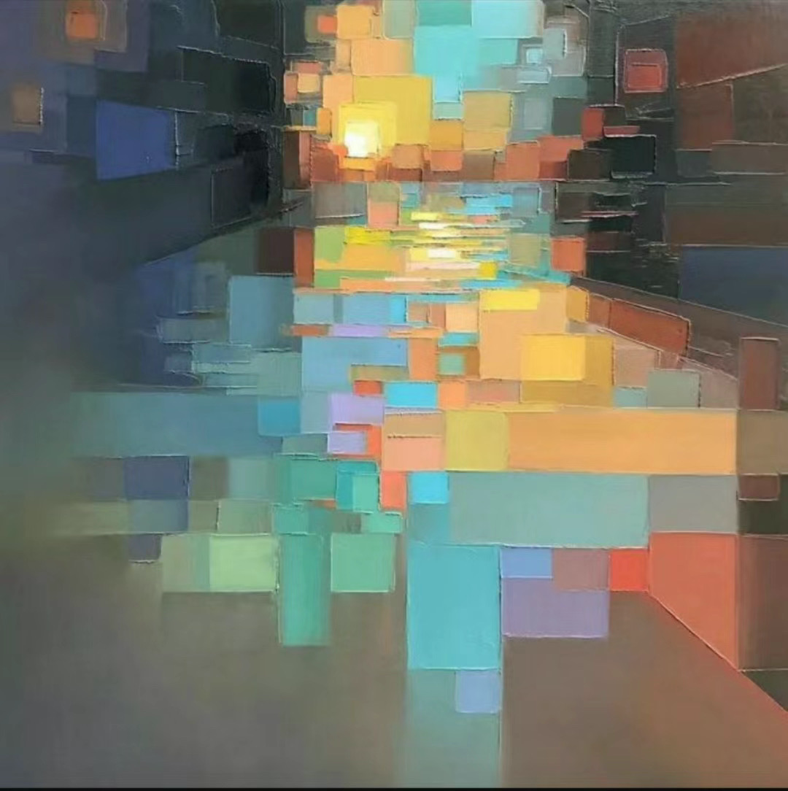

-1920x1080-82bc3c22e0437cd6a7acb7b9d7be92d7.png)

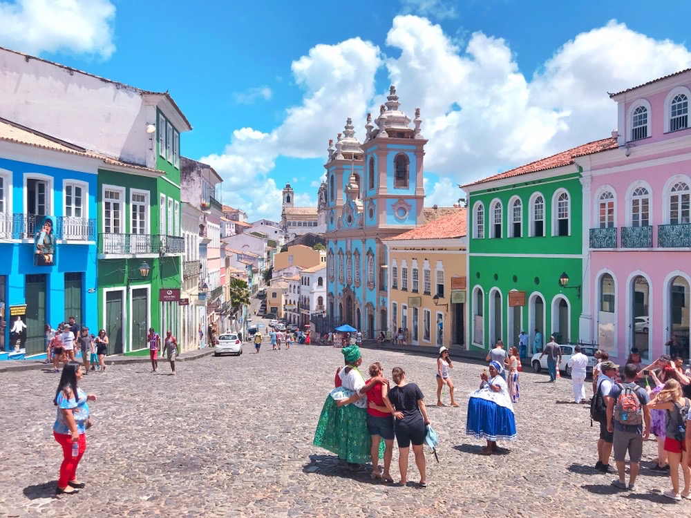

### UI 界面配色

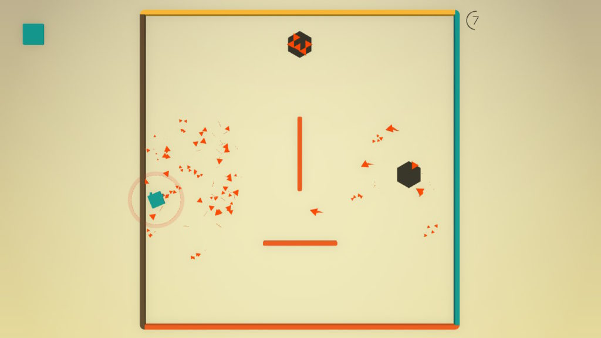

### 万花筒

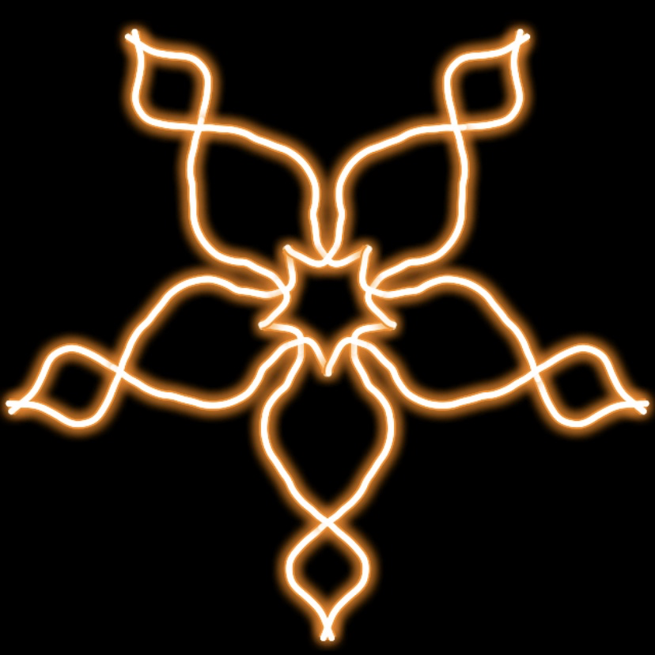

### 